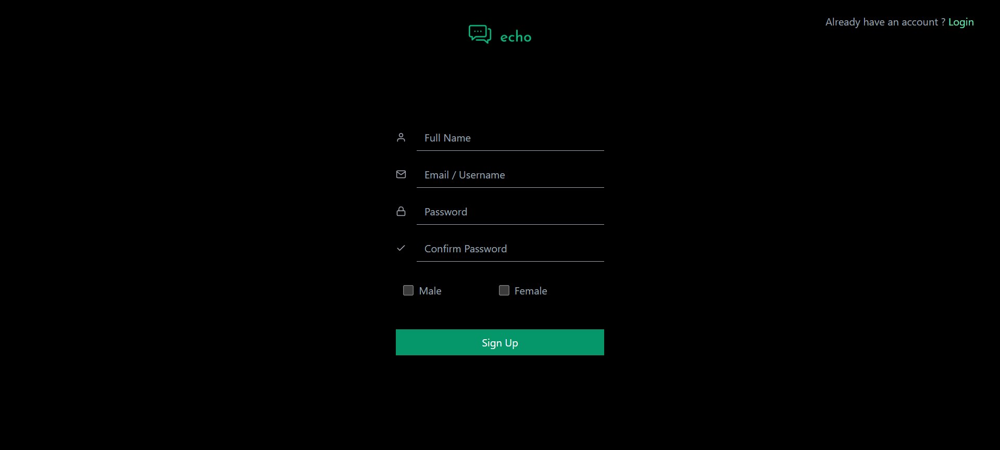
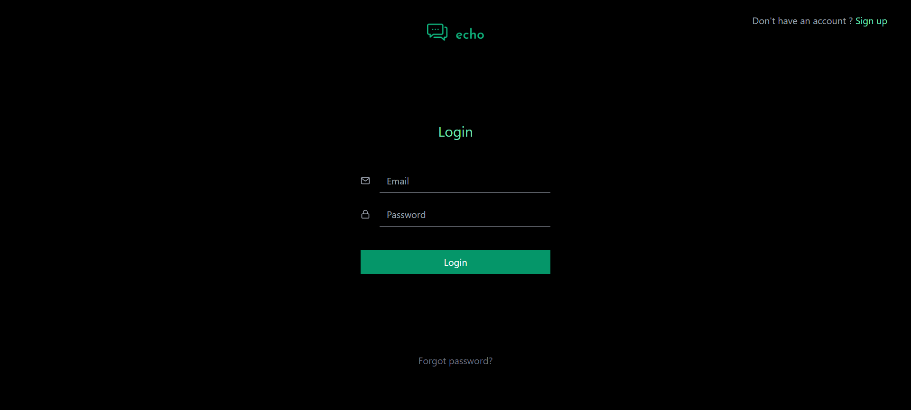
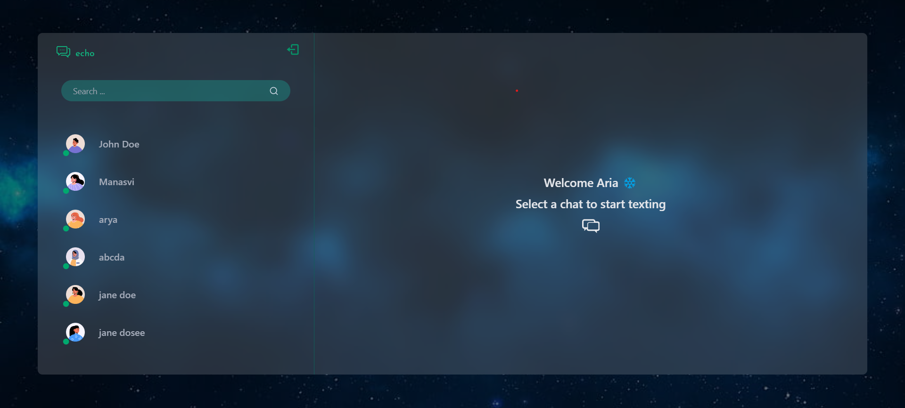
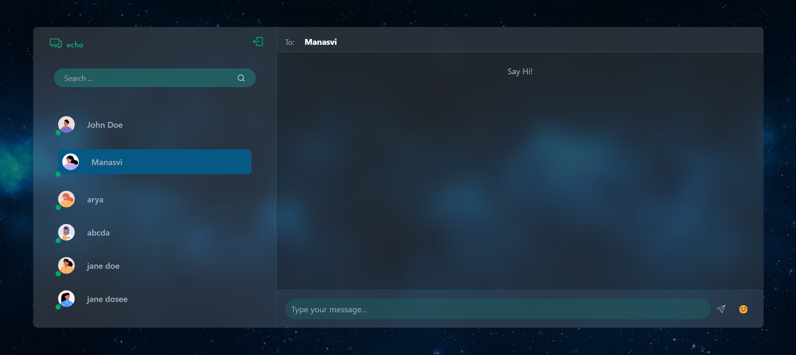
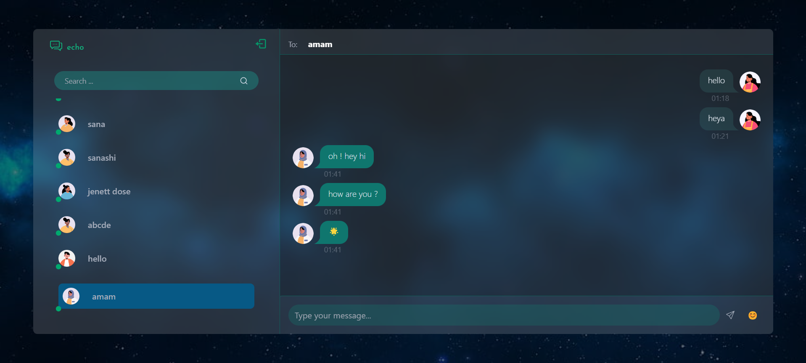

# Echo

Welcome to the Chat App! This application allows users to log in, chat with friends, and manage shared expenses using a modern tech stack.

## Features

- **Real-time Chat**: Communicate with friends in real time.
- **User Management**: Log in and manage your account.

## Technologies Used

- **Frontend**: ReactJS, TailwindCSS
- **Backend**: NodeJS, Express
- **Database**: MongoDB
- **Real-time Communication**: Socket.io
- **Authentication**: JWT(JSON Web Tokens)
- **Other libraries**: Bcrypt.js, etc

## Video Demo

Check out the video below to see the basic functioning of the app:

[Functioning of App](functioning%20of%20app.mp4)


## Screenshots

Here are some screenshots of the app's local host server, including the signup and login pages:

- **Signup Page**
  

- **Login Page**
  

- **Home Page**
   

- **Conversations Page**
   

- **Texts Page**
   

## Installation and Setup

1. **Clone the Repository**

   ```bash
   git clone https://github.com/yourusername/chat-app.git
